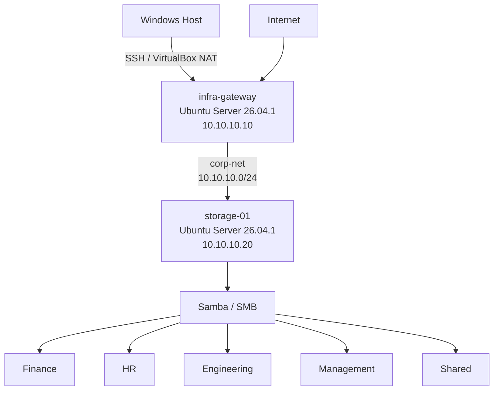
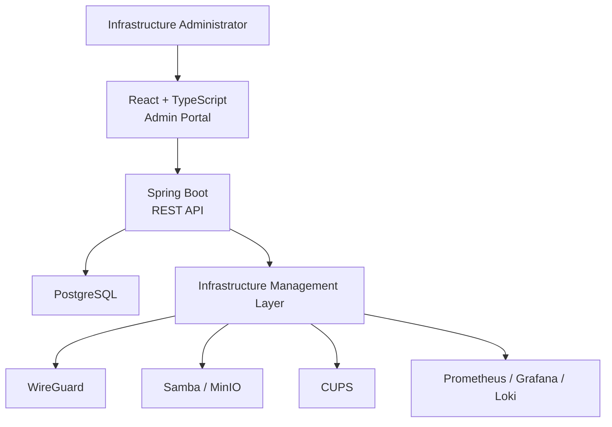

# Enterprise Infrastructure Platform

> A production-inspired enterprise infrastructure environment combining secure remote access, centralized storage, identity-based access control, monitoring, printing, automation, and a custom infrastructure management platform.


---

## Project Vision

This project builds a realistic enterprise infrastructure environment from the infrastructure layer upward.

Rather than creating only a simulated dashboard, the platform is backed by real Linux servers, networking, storage services, authentication, permissions, monitoring, and eventually secure remote access.

The final system will combine:

- Real Linux infrastructure
- Secure corporate networking
- Enterprise storage
- VPN remote access
- Print infrastructure
- Monitoring and observability
- Java / Spring Boot management APIs
- React / TypeScript administration interface
- PostgreSQL
- Docker and CI/CD
- Kubernetes and cloud infrastructure

---

# Current Architecture



---

# Network Foundation

Private corporate network:

```text
10.10.10.0/24
```

| Server | Role | Internal IP |
|---|---|---|
| `infra-gateway` | Gateway / future VPN / firewall | `10.10.10.10` |
| `storage-01` | Enterprise file and storage server | `10.10.10.20` |

Each virtual machine currently uses two network interfaces:

### Adapter 1 — NAT

Used for:

- Internet access
- Ubuntu updates
- Package installation

### Adapter 2 — Internal Network

VirtualBox network:

```text
corp-net
```

Used exclusively for internal corporate communication.

---

# Remote Administration

Both servers use OpenSSH.

Windows host access:

```text
localhost:2222 → infra-gateway:22
localhost:2223 → storage-01:22
```

Internal server-to-server SSH also works across `corp-net`.

Example:

```text
infra-gateway
10.10.10.10
      |
      | SSH
      v
storage-01
10.10.10.20
```

---

# Enterprise File Server

`storage-01` currently runs:

- Ubuntu Server
- Samba / SMB
- Linux users
- Linux groups
- POSIX permissions
- Department-based authorization

Company storage:

```text
/srv/company/

├── engineering
├── finance
├── hr
├── management
└── shared
```

---

# Identity and Access Control

Linux department groups:

```text
finance
hr
engineering
management
company-shared
```

Current test employees:

| User | Department | Shared Access |
|---|---|---:|
| Sarah | Finance | Yes |
| Adam | HR | Yes |
| Youssef | Engineering | Yes |

Department directories use:

```text
2770
```

This provides:

```text
Owner   → Read / Write / Execute
Group   → Read / Write / Execute
Others  → No Access
```

The setgid bit ensures that newly created files inherit their department group.

---

# Authorization Example

Sarah belongs to:

```text
finance
company-shared
```

Expected permissions:

| Resource | Access |
|---|---:|
| Finance | ✅ Allowed |
| Shared | ✅ Allowed |
| HR | ❌ Denied |
| Engineering | ❌ Denied |
| Management | ❌ Denied |

These permissions have been tested at both the Linux filesystem and Samba layers.

---

# Samba

Current SMB shares:

```text
finance
hr
engineering
management
shared
```

Samba authentication has been configured for:

```text
sarah
adam
youssef
```

A real SMB transfer has already been validated:

```text
infra-gateway
      |
      | SMB
      v
storage-01
      |
      v
Finance share
      |
      v
finance-report.txt
```

The test verified:

- Network connectivity
- SMB connectivity
- Samba authentication
- Department authorization
- Write permissions
- Group inheritance
- Unauthorized access rejection

---

# Current Progress

## Phase 1 — Network Foundation ✅

- [x] VirtualBox laboratory
- [x] Ubuntu Server installation
- [x] `infra-gateway`
- [x] `storage-01`
- [x] Private `corp-net`
- [x] Static internal IPv4 addresses
- [x] Internet connectivity
- [x] DNS validation
- [x] SSH administration
- [x] Server-to-server communication
- [x] Windows SSH access

---

## Phase 2 — Enterprise Storage :quotas and advanced access control 🚧

### Completed

- [x] Samba installation
- [x] Company directory structure
- [x] Department Linux groups
- [x] Test employee accounts
- [x] Department permissions
- [x] Samba authentication
- [x] Samba shares
- [x] SMB connectivity
- [x] Unauthorized access testing
- [x] SMB file upload test
- [x] Group inheritance test

### Next

- [x] Dedicated data disk
- [x] GPT partitioning
- [x] ext4 filesystem
- [x] Persistent `/etc/fstab` mount
- [x] Safe Samba data migration
- [x] Storage mount hardening
- [x] Reboot persistence validation
- [ ] Storage quotas
- [ ] POSIX ACLs
- [ ] Backup system
- [ ] Restore testing
- [ ] File access auditing
- [ ] Disk health monitoring
- [ ] MinIO object storage

---

# Future Phases

## Phase 3 — Secure Remote Access

- [ ] WireGuard VPN
- [ ] VPN address space
- [ ] User provisioning
- [ ] Device provisioning
- [ ] Firewall
- [ ] IP forwarding
- [ ] Routing
- [ ] VPN-only storage access
- [ ] Key rotation
- [ ] VPN audit logs

---

## Phase 4 — Print Infrastructure

- [ ] CUPS
- [ ] Print server
- [ ] Network printer simulation
- [ ] Department printer access
- [ ] Print queues
- [ ] Usage tracking
- [ ] Print analytics

---

## Phase 5 — Observability

- [ ] Prometheus
- [ ] Node Exporter
- [ ] Grafana
- [ ] Loki
- [ ] CPU metrics
- [ ] Memory metrics
- [ ] Disk metrics
- [ ] Network metrics
- [ ] Samba metrics
- [ ] VPN metrics
- [ ] Alerts

---

## Phase 6 — Spring Boot Control Plane

Planned REST APIs:

```text
/api/auth
/api/employees
/api/departments
/api/servers
/api/storage
/api/shares
/api/vpn
/api/devices
/api/backups
/api/audit
/api/security
/api/printers
/api/monitoring
```

Technologies:

- Java
- Spring Boot
- Spring Security
- PostgreSQL
- REST
- JWT
- RBAC

---

## Phase 7 — React Administration Platform

Planned frontend modules:

- Infrastructure dashboard
- Employee management
- Department management
- Server health
- Storage management
- File-share permissions
- VPN management
- Device management
- Backup management
- Security events
- Audit logs
- Printer management
- Monitoring

---

# Future Control Plane Architecture



---

# Planned DevOps Evolution

```text
Source Code
    |
    v
GitHub
    |
    v
GitHub Actions
    |
    +--> Tests
    |
    +--> Security Scan
    |
    +--> Build
    |
    +--> Docker Images
            |
            v
        Deployment
```

Future technologies:

- Docker
- Docker Compose
- GitHub Actions
- Kubernetes
- AWS
- Terraform

---

# Engineering Concepts Demonstrated

This project is designed to demonstrate practical experience with:

### Systems

- Linux administration
- Processes and services
- systemd
- Filesystems
- Storage
- Users and groups

### Networking

- IPv4
- Subnetting
- NAT
- Internal networks
- Routing
- DNS
- SSH
- SMB
- VPN

### Security

- Authentication
- Authorization
- RBAC
- Filesystem permissions
- Department isolation
- Private networks
- Secure remote access
- Audit logging

### Backend Engineering

- Java
- Spring Boot
- PostgreSQL
- REST APIs
- Security
- Infrastructure integration

### DevOps

- Git
- GitHub
- CI/CD
- Docker
- Monitoring
- Infrastructure automation
- Kubernetes
- Cloud

---

# Repository Structure

```text
enterprise-infrastructure-platform/

├── backend/
├── frontend/
│
├── infrastructure/
│   ├── networking/
│   ├── storage/
│   ├── vpn/
│   ├── printing/
│   └── monitoring/
│
├── docs/
│   ├── 01-network-foundation.md
│   └── 02-file-server.md
│
├── diagrams/
│
├── README.md
├── CHANGELOG.md
└── .gitignore
```

---

# Development Method

Each infrastructure feature follows this lifecycle:

```text
DESIGN
   ↓
BUILD
   ↓
TEST
   ↓
FAILURE TEST
   ↓
SECURITY HARDENING
   ↓
OBSERVABILITY
   ↓
DOCUMENT
   ↓
COMMIT
   ↓
PUSH
```

The goal is not simply to make services work.

The goal is to understand, secure, observe, automate, document, and operate them like real infrastructure.

---

# Current Focus

> **Phase 2 — Enterprise Storage**

Next engineering milestone:

**Dedicated storage volume and separation of operating-system data from company business data.**

---

## Status

🚧 **Active Development**